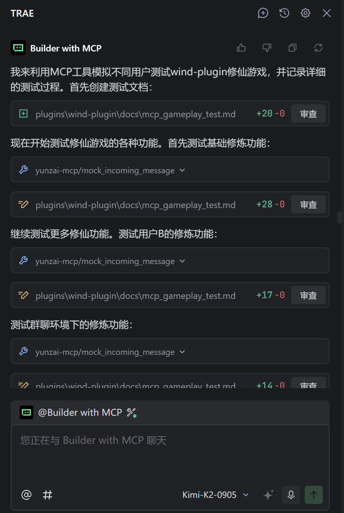

# Yunzai-MCP-Plugin

一个为Yunzai-Bot提供LLM通信能力的插件，支持全权限调试和控制功能

## 已实现的功能特性

- 🚀 **全权限访问**: 计划支持Bot重启、关闭、简易消息收发等
### 效果演示

### TO DO
- [ ] 内置Context Engine以减少agent阅读代码时的token消耗以及索引效率提升  
- [ ] 对非合作Bot进行扫描、调试、风险评估、功能分析与二次开发
- [ ] 针对国产模型优化，提升较小上下文窗口条件下的开发质量


### 示例
以下内容用于在你的IDE中**以json格式**导入MCP时候使用，注意替换路径
```
{
  "mcpServers": {
    "yunzai-mcp": {
      "command": "node",
      "args": [
        "C:\\Users\\X\\Desktop\\Bot-Dev\\Yunzai\\plugins\\Yunzai-MCP-plugin\\dist\\mcp-server.js"
      ],
      "env": {
        "YUNZAI_API_KEY": "mcp-yunzai-2024",
        "YUNZAI_BASE_URL": "http://127.0.0.1:2536",
        "YUNZAI_MCP_PATH": "/MCP"
      }
    }
  }
}

```
## License

[GNU AGPLv3](https://www.gnu.org/licenses/agpl-3.0.html)：任何基于本插件的衍生项目，在分发或提供网络服务时，**其完整源代码也必须以 AGPLv3 协议开源**。这从根本上禁止了任何形式的闭源开发。

## Acceptable Use Policy

本项目旨在促进技术交流与创新，我们坚决反对任何利用本项目代码从事非法或不道德活动的行为。

**严禁**将本项目的任何部分用于包括但不限于以下活动：
- 营利性闭源插件开发
- 其它涉及传销、诈骗、引流、变现等的项目或有碍社区发展和违背社会公序良俗的活动

虽然许可证（AGPLv3）本身不限制使用领域，但作为项目所有者，我们保留对任何滥用本项目代码的行为进行公开谴责、以及在社区层面进行抵制的权利。我们鼓励所有用户监督和报告此类滥用行为。

**使用本项目即代表您同意并遵守上述授权条款之一。**
